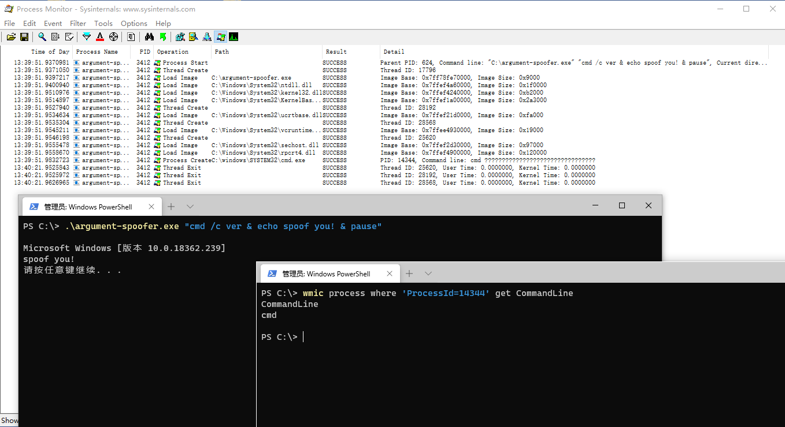

# ArgumentSpoofer

Create a process, pass spoofed command line and `SUSPENDED` flag to suspend the primary thread immediately

Then retrieve the PEB and modify `PEB.ProcessParameters.CommandLine` Buffer and MaximumLength

Finally resume the primary thread

**On x64 OS, only work while compiling as x64 binary**

***

If only modified the `CommandLine.Buffer`, we can spoof ProcessMonitor, but can't spoof real-time process information query (e.g. WMIC)

By modifying the `CommandLine.MaximumLength`, we can spoof real-time process information query. Because they need to judge the Length first while parsing the `PEB.ProcessParameters.CommandLine`

But process will ignore `MaximumLength / Length` while running. **It's a inconsistency**

***

Learn from [link](https://blog.xpnsec.com/how-to-argue-like-cobalt-strike/). This article has a error: the `CommandLine.Length` parameter doesn't affect the parsing, only `CommandLine.MaximumLength` does

Codes in this article works because it modifies `CommandLine.Length` as a 4-byte DWORD, but actually `CommandLine.Length` is a 2-byte unsigned short, so it accidentally modified `CommandLine.MaximumLength` with 0

